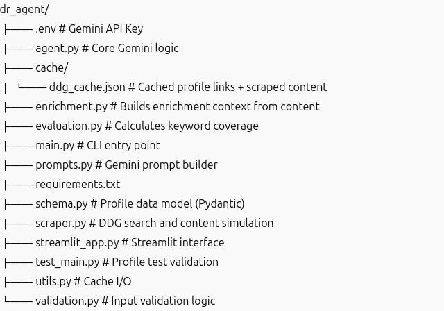
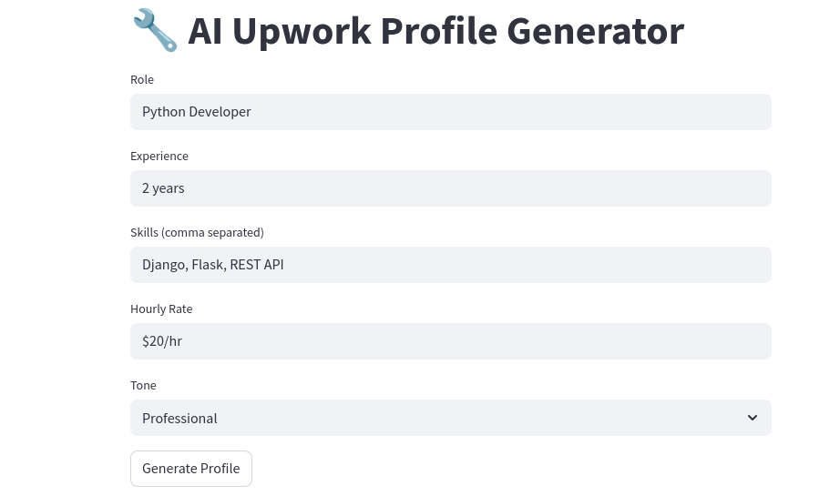
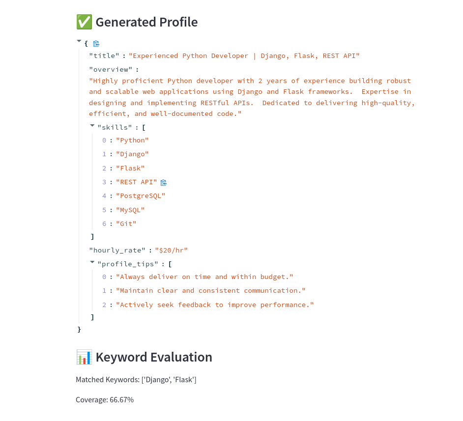

# 🧠 DR Agent – AI-Powered Upwork Profile Generator (Phase 2)

This project generates high-quality, enriched Upwork freelancer profiles using real-world scraped content and Google Gemini AI.

## ✅ Phase 2 Highlights

- 🔍 **DuckDuckGo-based Upwork profile search** with caching  
- ✨ **Dynamic enrichment** using real content (no hardcoded keywords)  
- 🤖 **Gemini-powered profile generation** using context-driven prompts  
- 📊 **Evaluation of keyword coverage and enrichment**  
- 🧪 **Unit tests and input validation**  
- 🌐 **Streamlit UI for live testing and feedback**

---

## 📁 Folder Structure



---

## 🛠️ Installation

```bash
git clone https://github.com/FathimaHusna/DR_Agent
cd dr_agent

# Create virtual environment
python -m venv dr_env
source dr_env/bin/activate  # On Windows: venv\Scripts\activate

# Install dependencies
pip install -r requirements.txt

🚀 How to Run

CLI
python main.py

Streamlit App
streamlit run streamlit_app.py

🔎 How It Works

    User Input: You provide role, skills, experience, tone, rate.

    Scraper: Uses DuckDuckGo to find Upwork profiles. Scraped data is cached.

    Enrichment: Extracts real keywords from scraped content (no hardcoded terms).

    Gemini AI: Generates JSON-formatted profile (title, overview, skills, rate, tips).

    Evaluation: Compares profile content with keywords to compute match and coverage.

    UI: Shows profile and performance in Streamlit.


    ✅ Sample Output

## 📸 Screenshots





    
   


🧪 Testing
pytest test_main.py

🧠 What's Next (Phase 3 Ideas)

    ✅ Real browser-based scraping using Playwright (with CAPTCHA handling)

    🔗 Integration with LangChain + Tavily for deeper research

    💾 Export profiles as PDF or copy to clipboard

    🌍 Public deployment of Streamlit frontend

👨‍💻 Author

Built by Husna
Project: Deep Research Agent (Upwork Profile Generator)


    